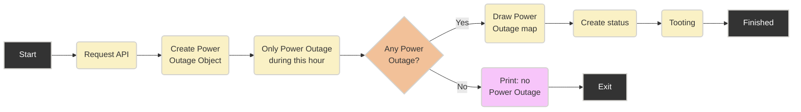

# California Power Outages Bot
- Toot about power outages in California.
  - Map of power outage.
  - Power Outage within current day and current hour.
  
Mastodon: https://mastodon.world/@california_power_outage
  
  

### Main flow
```
main.py
```

### Tests
```
python -m unittest discover
```

### Flowchart 

